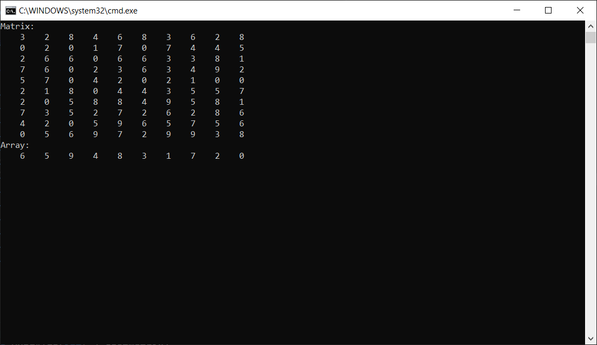

# HungarianAlgorithmOSlab4

## Theory

***The Hungarian algorithm*** is a combinatorial optimization method, that solves the assignment problem in polynomial time, and which anticipated later primal-dual methods. In other words, based on a matrix of possible combinations of costs, the algorithm returns an ordered collection of matches, having the lowest combined cost, thus being the most optimal assignment.

**The Hungarian algorithm consists of the following steps:**

1) In each column of the matrix we find the minimum element and subtract from each element of this column.
2) In each row of the matrix we find the minimum element and subtract from each element of the column.
3) At least one "0" must appear in each row and column. From this matrix we take all "0" and replace with "1".
4) Find the maximum pairing. If we get a perfect variant, we will transfer it to the first matrix, we will receive the minimum sum and we will pass to point 16 of algorithm). If not, do the following.
5) On this matrix, mark the zeros that are included in the solution from step 4 and those that are not (crossed out). Note the lines that have crossed out "0".
6) Note those columns in which there are crossed out zeros of the marked rows.
7) Note the line containing the marked "0", which contains the line marked in the previous step.
8) Note the column in which there is a crossed out "0", which contains the row marked in the previous step.
9) Mark the dotted columns and unnoticed rows.
10) Write out the elements through which the dotted lines pass and among them look for the minimum element.
11) Subtract this minimal element from those columns of the matrix through which do not pass dotted lines.
12) Add this element to those lines through which the dotted lines pass.
13) The merged units are transferred to the initial matrix.
14) Let's move on to point 4
15) The end of the solution.

## The Algorithm
The example below, shows how to use and apply the algorithm.  
It defines a two-dimensional array, passes it to algorithm, and recieves a result of an array of matched columns for each row (x) passed.
```csharp
static void Main(string[] args)
        {
            const int SIZE = 10;

            var matrix = generateMatrix(SIZE);

            printMatrix(matrix);

            var algorithm = new HungAlgo(matrix);

            var result = algorithm.Run();

            printArray(result);

        }
```
### Output



## Working time
Let's estimate time of operation of algorithm. In the outer loop, we add the rows of the matrix one by one. Each row is processed for time O (n2), because only O (n) potential recalculations could take place (each for time O (n)), for which the array minv is supported for time O (n2); Kuhn's algorithm will work in total for the time O (n2) (because it is presented in the form of O (n) iterations, each of which is visited by a new column).

***The final asymptotics is O (n3).***


